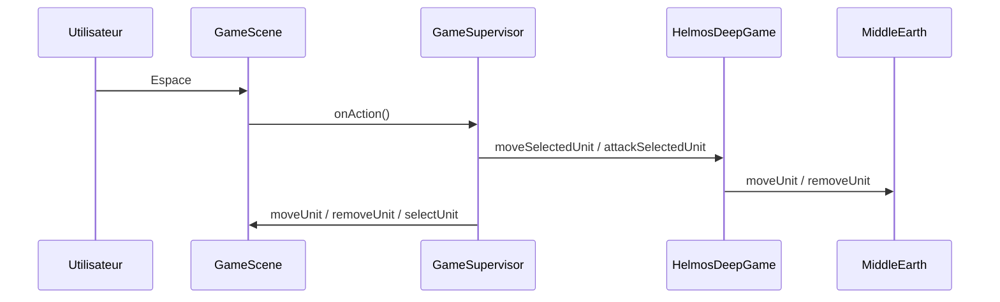

# Architecture du projet

## Vue d'ensemble

HelmosDeep suit une architecture en **couches** imposée par le cours (validée par `ArchTest.java`) :

```
helmosdeep/
├── domains/      ← Règles du jeu (modèle)
├── supervisors/  ← Contrôleurs (pont vue ↔ modèle)
├── views/        ← Affichage (Swing + ai-engine)
└── util/         ← Utilitaires (lecture fichier, contrats)
```

### Règles de dépendance

| Package | Peut utiliser |
|---------|----------------|
| `domains` | `domains`, `util`, JDK standard |
| `supervisors` | `domains`, `supervisors`, `util.Contract` |
| `views` | `supervisors`, `views`, moteur `ai.engine.*` |

Le domaine **ne doit jamais** importer la vue ni Swing. C'est ce qui permet de tester la logique sans lancer la fenêtre graphique.

---

## Classes principales du domaine

### `MiddleEarth`

Représente la **carte** : grille de `Tile`, deux armées (`Army` Hommes / Mordor).

- Charge une carte depuis une chaîne texte (format décrit dans le README).
- `isPassable(coord, from)` : une case est traversable si elle est **vide** (sauf la case de départ).
- `getMovementCost(dest, unitType)` : coût pour **entrer** sur une case (terrain + règle unité lourde).
- `moveUnit(unit, dest)` : déplace l'unité dans la grille (source vidée, destination remplie).
- `removeUnit(unit)` : retire une unité morte de la tuile **et** de son armée.

### `HelmosDeepGame`

Représente une **partie en cours** :

- Tour actuel : Mordor ou Hommes (`mordorTurn`).
- Unité sélectionnée (`selectedUnit`).
- Délègue les actions : `moveSelectedUnit`, `attackSelectedUnit`, `endTurn`.
- Détecte la fin de partie : `isGameOver()`.

### `Unit`

Une figurine sur la carte :

- Type (`EUnitType`), nom, coordonnées, points de mouvement restants (`mvtRestants`), état `alive`.
- Calcul de puissance : `getAttackPower(MiddleEarth)`.
- Combat : `attack(defender, middleEarth)`.
- Les généraux ne peuvent pas attaquer : `canAttack()`.

### `MoveManager`

Algorithme de **pathfinding** (Dijkstra) sur la grille hexagonale. Voir le chapitre dédié.

### `Army`

Liste des unités d'une faction + compteur de kills (`killCount`).

---

## Superviseurs

### `GameSupervisor`

Cœur de la **boucle interactive** :

1. Reçoit les événements clavier via `GameViewListener`.
2. Modifie `HelmosDeepGame`.
3. Met à jour `GameView` (hexagones, unités, caméra, panneau Situation).

Le curseur (`currentRow`, `currentCol`) est géré **ici**, pas dans le domaine : c'est un concept d'interface.

### `MainMenuSupervisor` / `GameOverSupervisor`

Navigation entre écrans (`ViewsId` : menu, jeu, fin de partie).

---

## Vues

### `GameScene`

Implémente `GameView` :

- Dessine la carte (`HexTile`, `UnitTile`).
- Gère le focus clavier (`setFocusable`, `KeyListener`).
- Anime déplacements et suppressions via `Tweens` (moteur ai-engine).

### `UnitTile`

Affiche le sprite (`resources/sprites/<nom>.png`) et les stats (`force-PM`).

Le nom de l'unité doit **correspondre exactement** au fichier PNG (ex. `"Aragorn"` → `aragorn.png`).

---

## Format d'une carte

Exemple `level-1.txt` :

```
5:9                    ← hauteur:largueur
LLLFFFFMM              ← terrain ligne 0
...
---------              ← séparateur
AGR.....T              ← unités ligne 0
...
```

- Ligne 0 : dimensions.
- Lignes 1 à `height` : terrain.
- Ligne `height+1` : séparateur `---------`.
- Lignes suivantes : placement des unités (même grille).

---

## Schéma du flux d'une action (Espace)



---

## Fichiers à lire en priorité

Pour comprendre une fonctionnalité, ouvre dans cet ordre :

1. `HelmosDeepGame.java` — orchestration partie
2. `GameSupervisor.java` — réaction aux touches
3. `MoveManager.java` ou `Unit.java` — selon le sujet
4. `GameScene.java` — rendu et animations
