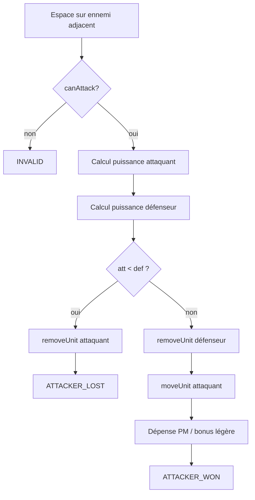

# Algorithme de combat

## Objectif

Permettre à une unité alliée **sélectionnée** d'attaquer un **ennemi adjacent** (hex voisin), comparer les puissances, éliminer le perdant, et mettre à jour la carte.

Fichiers principaux :

- `Unit.java` — calcul puissance + résolution du duel
- `HelmosDeepGame.java` — `attackSelectedUnit`
- `AttackOutcome.java` — résultat remonté à la vue
- `GameSupervisor.java` — branchement touche Espace

---

## Déclencher une attaque (côté joueur)

1. Sélectionner une unité alliée (Espace sur sa case).
2. Déplacer le **curseur** (flèches) sur un **ennemi voisin**.
3. Appuyer sur **Espace**.

Le superviseur détecte : case cible occupée par un ennemi → appelle `attackSelectedUnit` au lieu de `moveSelectedUnit`.

---

## Conditions pour qu'une attaque soit valide

Vérifiées dans `HelmosDeepGame.attackSelectedUnit` et `Unit.attack` :

| Condition | Si fausse |
|-----------|-----------|
| Une unité est sélectionnée | Attaque ignorée |
| L'attaquant `canAttack()` | Général → impossible |
| Case cible a une unité ennemie | Ignoré |
| Ennemi **adjacent** (voisin hex) | Ignoré |
| Attaquant et défenseur vivants | Ignoré |

### Généraux (Aragorn, Sauron)

`canAttack()` retourne `false` pour `EUnitType.GENERAL`.

Ils ne lancent pas d'attaque, mais leur **présence à côté d'un allié** compte dans le calcul de puissance (bonus alliés voisins).

---

## Calcul de la puissance d'attaque

```java
puissance = force_du_type + nb_alliés_voisins + dé(1..6)
```

### Force de base (`EUnitType`)

| Type | Force |
|------|-------|
| Légère | 1 |
| Moyenne | 2 |
| Lourde | 3 |
| Général | 4 |

### Alliés voisins

`Army.getNbOfAllies(neighbours)` compte combien d'unités **de la même armée** sont sur les 6 cases adjacentes à l'unité qui calcule sa puissance.

Exemple : un Troll avec 2 Orcs voisins → bonus +2.

### Dé aléatoire

`(int)(Math.random() * 6) + 1` → entier entre **1 et 6** inclus.

Chaque camp lance **son propre dé** au moment du calcul.  
C'est pourquoi un Ent (force 3) peut perdre contre un Troll (force 3) : le Troll peut avoir plus d'alliés ou un meilleur jet.

---

## Résolution du duel

```
attackerPower ← attaquant.getAttackPower(middleEarth)
defenderPower ← défenseur.getAttackPower(middleEarth)

si attackerPower < defenderPower :
    → l'attaquant meurt (removeUnit)
    → retour false

sinon (attackerPower >= defenderPower) :
    → le défenseur meurt (removeUnit)
    → killCount++ pour l'armée de l'attaquant
    → l'attaquant occupe la case du défenseur (moveUnit)
    → l'attaquant dépense tous ses PM restants
    → si unité LÉGÈRE : regagne 1 PM (bonus post-attaque)
    → retour true
```

### Égalité de puissance

Si `attackerPower == defenderPower`, l'**attaquant gagne** (condition `<`, pas `<=`).

---

## Conséquences sur la partie

### Unité éliminée

`MiddleEarth.removeUnit(unit)` :

1. Vide la tuile à ses coordonnées.
2. Appelle `unit.die()`.
3. Retire l'unité de la liste `Army` (Hommes ou Mordor).

### Fin de partie

`HelmosDeepGame.isGameOver()` : true si une armée n'a **plus aucune unité**.

Le superviseur envoie alors vers l'écran `ViewsId.GAME_OVER`.

---

## Objet `AttackOutcome`

Encapsule le résultat pour que la **vue** sache quoi animer :

| Résultat | Effet visuel |
|----------|--------------|
| `ATTACKER_LOST` | `removeUnit` sur la case de l'attaquant |
| `ATTACKER_WON` | `removeUnit` défenseur + `moveUnit` attaquant → case du défenseur |
| `INVALID` | Rien |

---

## Cas d'école : Ent vs Troll

Les deux sont **lourds** (force 3, 2 PM).

Scénario où l'Ent disparaît :

- Ent seul, Troll avec 1 allié voisin ;
- Ent : 3 + 0 + dé = par ex. 3+0+2 = **5** ;
- Troll : 3 + 1 + dé = par ex. 3+1+4 = **8** ;
- 5 < 8 → **Ent éliminé**. Comportement normal, pas un bug graphique.

Scénario où l'Ent gagne :

- Troll disparaît ;
- Ent apparaît sur la case du Troll (animation de déplacement).

---

## Schéma du flux de combat



---

## Code à étudier

Ordre de lecture recommandé :

1. `Unit.getAttackPower`
2. `Unit.attack`
3. `HelmosDeepGame.attackSelectedUnit`
4. `GameSupervisor.applyAttackOutcome`

---

## Piste d'amélioration (partiellement implémentée)

~~Afficher dans le panneau **Situation** le détail du combat~~ → implémenté, voir [09-stats-et-affichage-combat.md](./09-stats-et-affichage-combat.md).

## Pistes d'évolution restantes

- IA adversaire
- Capacités spéciales (attaque à distance, etc.)
- Animation du déplacement case par case via `findPath`
- Sélection de la carte au menu (aujourd'hui : `level-1.txt` par défaut)

Voir aussi [05-journal-des-mises-a-jour.md](./05-journal-des-mises-a-jour.md) pour l'état détaillé du projet.
