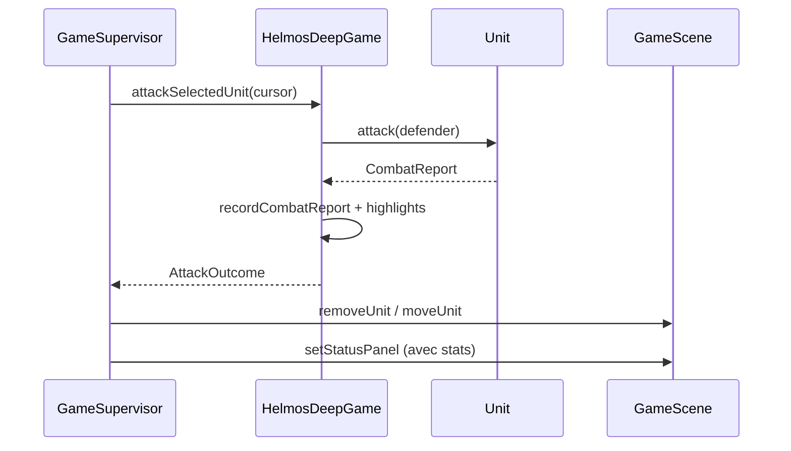

# Stats et affichage des combats

Ce chapitre décrit le **système de statistiques** branché sur l'interface : ce qui est calculé dans le domaine, ce qui s'affiche pendant la partie, et ce qui apparaît à l'écran de fin.

---

## Vue d'ensemble

```
Combat (domaine)
    ↓ CombatReport + compteur kills (Army)
HelmosDeepGame (historique + scores)
    ↓
GameSupervisor → panneau Situation (partie en cours)
GameOverSupervisor → panneaux fin de partie
```

---

## Puissance d'attaque détaillée

Chaque camp lance un calcul **une seule fois** par combat (les dés ne sont pas relancés).

### Formule

```
total = force + alliés_voisins + dé
```

| Composante | Source |
|------------|--------|
| `force` | `EUnitType.getForce()` (1 à 4) |
| `alliés_voisins` | `Army.getNbOfAllies()` sur les 6 hex adjacents |
| `dé` | entier aléatoire entre 1 et 6 |

### Classes

| Classe | Rôle |
|--------|------|
| `AttackPowerBreakdown` | Record `force`, `allies`, `dice` + `total()` et `formatCompact()` |
| `Unit.rollAttackPower()` | Calcule le breakdown pour une unité |
| `CombatReport` | Résultat d'un duel avec les deux breakdowns |

Exemple compact : `3+1+4=8` (force 3, 1 allié, dé 4).

---

## Compte-rendu de combat (`CombatReport`)

Créé à la fin de `Unit.attack()` :

| Champ | Description |
|-------|-------------|
| `attackerName` / `defenderName` | Noms affichés |
| `attackerPower` / `defenderPower` | Breakdowns figés au moment du duel |
| `attackerWon` | `true` si attaquant ≥ défenseur |

### Messages formatés

**Pendant la partie** (`formatSituationLine`) :

```
Combat : Ent 8 bat Troll 6 (3+1+4 vs 3+0+3)
```

```
Combat : Ent 5 vaincu par Troll 8 (3+0+2 vs 3+2+3)
```

**Fin de partie** (`formatHighlight`) :

```
Ent (3+1+4=8) élimine Troll (3+0+3=3)
```

---

## Scores des armées

Chaque `Army` maintient :

| Stat | Méthode | Signification |
|------|---------|---------------|
| Unités restantes | `getUnitCount()` | Taille de la liste (unités vivantes sur la carte) |
| Unités éliminées | `getKillCount()` | Incrémenté à chaque kill (`recordKill()`) |

`HelmosDeepGame.getArmyScoreLine()` produit :

```
Scores : Hommes 5u/2K — Mordor 4u/1K
```

(`u` = unités restantes, `K` = kills)

---

## Panneau Situation (pendant la partie)

Fichier : `GameSupervisor.refreshStatusPanel()`

Les **4 premières lignes** restent identiques (compatibles tests AI-1 / AI-2) :

1. Titre du match
2. Tour actuel
3. Case active (col, row)
4. Terrain sous le curseur

**Lignes supplémentaires** (optionnelles) :

5. Ligne de scores des deux armées (toujours)
6. Dernier combat (`lastCombatReport`) si un combat a eu lieu
7. Unité sélectionnée (`force-PM`) si une unité est active

Exemple après un combat :

```
Le Mordor vs les Hommes
Au tour des Hommes
Case active : 4, 2
PLAINE [1]
Scores : Hommes 4u/1K — Mordor 5u/0K
Combat : Ent 5 vaincu par Troll 8 (3+0+2 vs 3+2+3)
Sélection : Gondoriens [2-3]
```

---

## Écran de fin de partie

Fichier : `GameOverSupervisor.onViewEntered()`

Le superviseur reçoit `IGameFactory` (comme `GameSupervisor`) pour lire la partie en cours.

### Panneau gauche — Hommes

- Unités restantes
- Unités éliminées (kills)
- « Victoire ! » ou « Défaite »

### Panneau droit — Mordor

- Même structure

### Panneau « Moments forts »

- Ligne du vainqueur (`getWinnerLabel()`)
- Historique des combats (8 derniers, du plus récent au plus ancien)

---

## Flux de données après une attaque



---

## Fichiers modifiés pour cette fonctionnalité

| Fichier | Changement |
|---------|------------|
| `AttackPowerBreakdown.java` | Nouveau — détail force+alliés+dé |
| `CombatReport.java` | Nouveau — compte-rendu formaté |
| `Unit.rollAttackPower()` | Expose le détail du calcul |
| `Unit.attack()` | Retourne `CombatReport` |
| `HelmosDeepGame` | `lastCombatReport`, `combatHighlights`, scores fin |
| `AttackOutcome` | Contient le `CombatReport` |
| `GameSupervisor` | Panneau Situation enrichi |
| `GameOverSupervisor` | Stats réelles + factory injectée |
| `HelmosDeep.java` | Passe `factory` au superviseur fin de partie |

---

## Pourquoi l'Ent a « disparu » ?

Si le panneau affiche :

```
Combat : Ent 5 vaincu par Troll 8 (3+0+2 vs 3+2+3)
```

L'Ent a **perdu** le duel : 5 < 8. La disparition du sprite est **normale**.

Compare les breakdowns `(force+alliés+dé)` pour comprendre **pourquoi** : ici le Troll avait plus d'alliés et/ou un meilleur dé.

---

## Pistes d'évolution

- Effacer `lastCombatReport` au changement de tour (au lieu de le garder)
- Afficher le breakdown **avant** d'attaquer (mode prévisualisation)
- Persister les stats entre plusieurs parties
- Tests unitaires sur `CombatReport` avec dés injectés (sans `Math.random()`)
